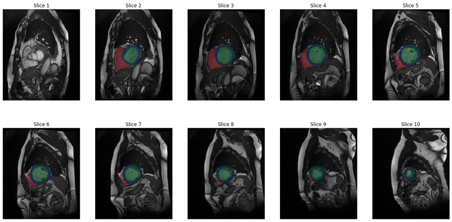

# Cardiac cine MR segmentation
This GitHub repository contains code for the Machine Learning tutorial held at ISMRM 2021. This repository is specifically about the segmentation task, in which participants segment the left ventricular cavity and myocardium, and the right ventricle in cardiac cine MR images. 

Jupyter notebooks are provided to help participants get started with:
* Loading and viewing data from the [ACDC](https://www.creatis.insa-lyon.fr/Challenge/acdc/) data set
* Setting up a minimal example to train a U-Net using PyTorch and MONAI

The notebook assumes that you have a Python distribution (such as [Anaconda](https://www.anaconda.com/products/individual)) and [JupyterLab](https://jupyter.org/) installed. Moreover, it requires [PyTorch](https://pytorch.org/) to be installed. 

Please use the GitHub Discussions feature (check out the menu bar above) to share your thoughts.

